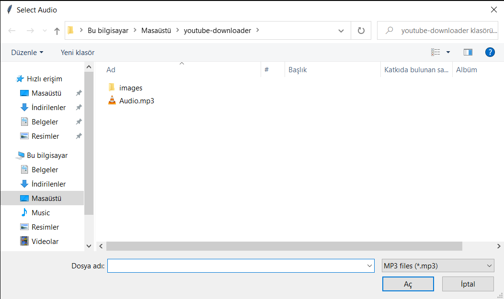

# youtube-downloader
You must have Tkinter and Pip installed on your system. <br />
If you are a Windows user, make sure to select "Add Python to PATH" when installing Python on your system.
Or you can go to the file path and run it from there :D

You also need to have `FFmpeg` installed on your system and assigned to the $PATH variable on the command line.

The reason why you need FFmpeg for youtube-downloader is this:

youtube-downloader uses the `adaptive=True` variable when using the download function in the pytube library. This allows you to download videos even at the highest quality. However, the disadvantage of this is that there is no sound when downloading these videos. Only the video is present. If you download video and audio files, you can use FFmpeg to combine them into a single MP4 file.

---

## Prerequisites:
```console
$ pip install -r requirements.txt
```

## Usage
```console
$ python downloader.py
$ python merge.py
```
---

- `downloader.py`: When you run this file, you can download the audio and video files of the video for which you entered the URL.

- `merge.py`: When you run this file, you will merge the video and audio files into a single file.

When you use youtube-downloader, the video and audio files you download are saved in the directory where the program is run.

 <br />
 <br />
 <br />
 <br />
 <br />